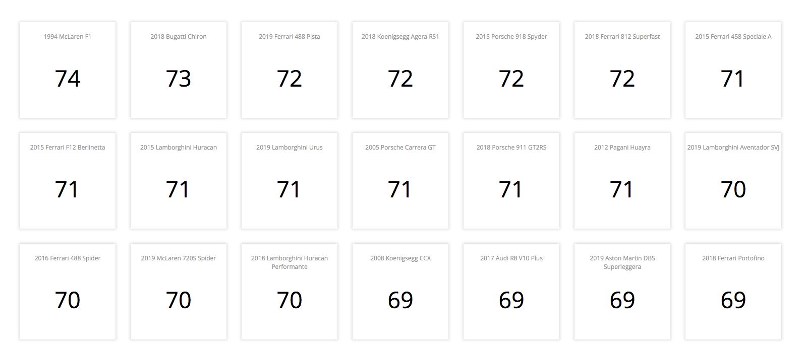

## Running The Project on Local Repo

1) After cloning the repository, navigate into the main directory and run ```npm install```

2) Once all the dependencies are downloaded, run ```npm run start``` command


##  Screenshots




